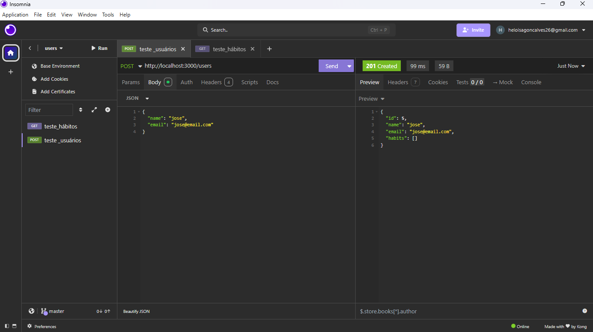
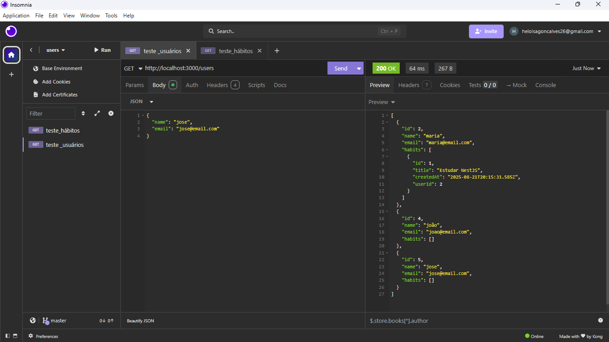
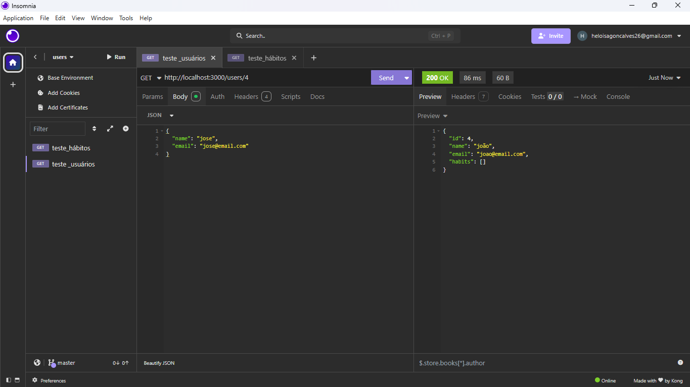
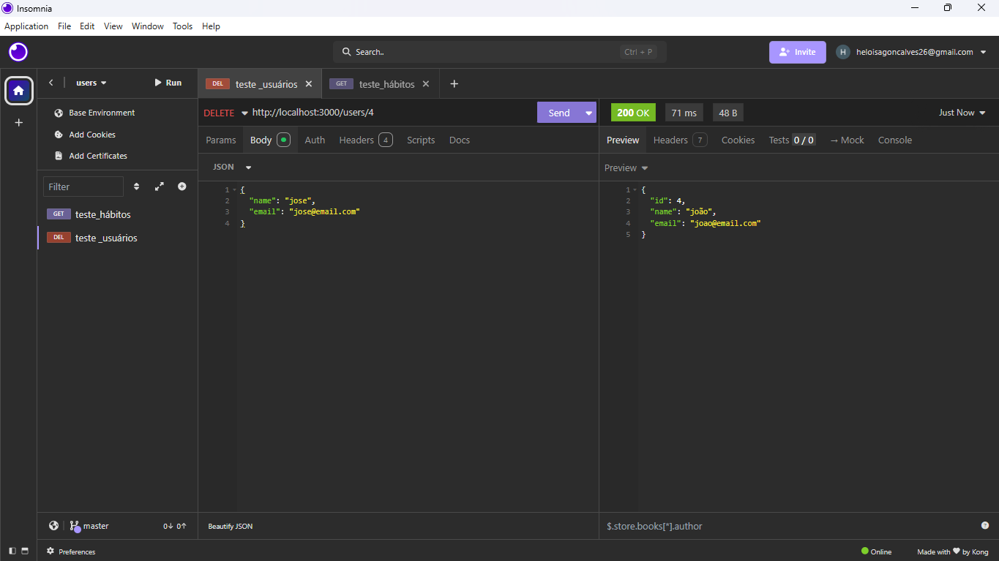
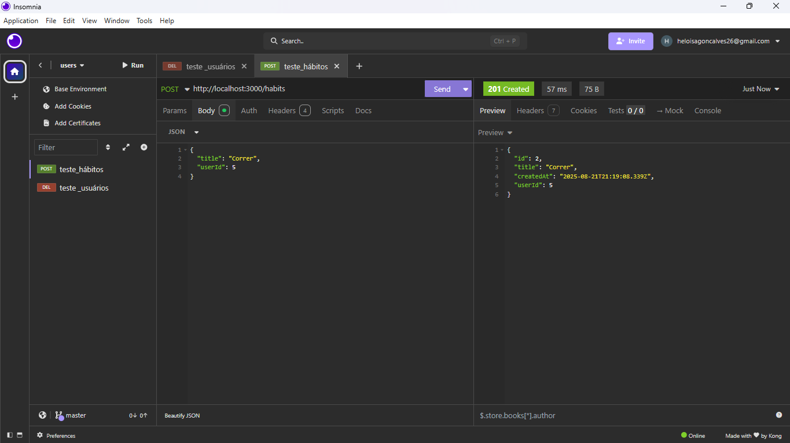
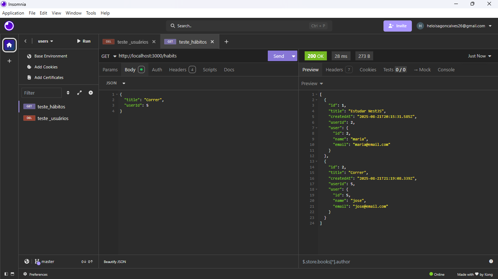
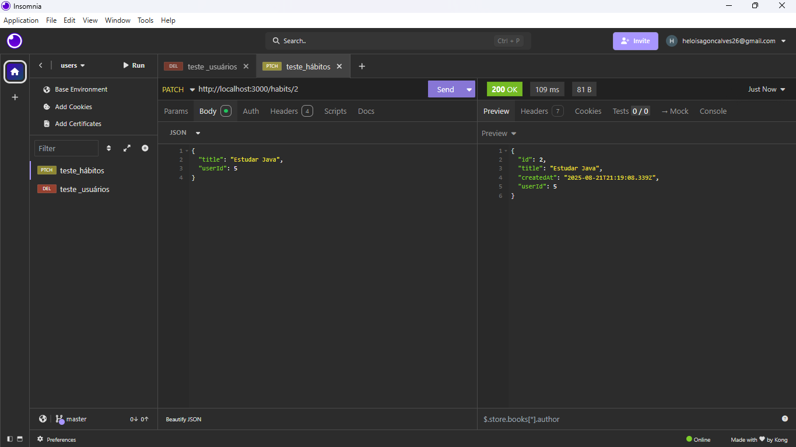
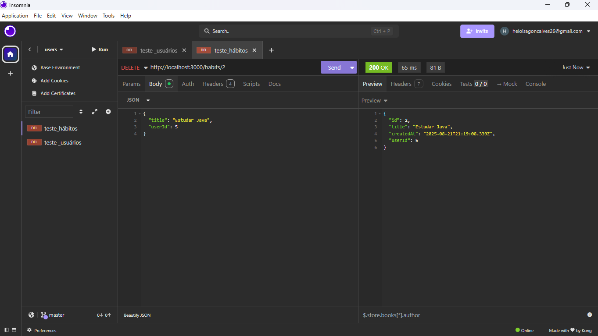

# Habile

Este projeto é uma API desenvolvida em **NextJS** para o backend do produto digital **Habile**, um aplicativo de gerenciamento de hábitos.

## Descrição do Aplicativo

O sistema possui duas entidades principais

* Habit - Cadastro de hábitos vinculado ao usuário
* User -  Cadastro de usuários do aplicativo


## Tecnologias 

* [NextJS](https://nestjs.com/)
* [Prisma ORM](https://www.prisma.io/)
* [SQLite](https://www.sqlite.org/index.html)

## Instalação

Clone o repositório:
```
git clone https://github.com/fernandadev-07/habits-api
cd habits-api
code .
```

Instale as dependências:

```
npm install
```

Configure o banco de dados com Prisma
```
npx prisma migrate dev

```
Abra o Prisma Studio
```
npx prisma studio

```
Inicie o servidor:
```
npm run start:dev

```

O servidor padrão:
```
http://localhost:3000

```

## Prints com as Requisições

### Cadastro de usuário
```
POST http://localhost:3000/users
```
<p align="center">
  
</p>

### Listar usuários 
```
GET http://localhost:3000/users
```
<p align="center">
  
</p>

### Buscar usuário pelo id
```
GET http://localhost:3000/users/id
```
<p align="center">
  
</p>


### Deleção de usuário
```
DELETE http://localhost:3000/users/id
```
<p align="center">
  
</p>

### Cadastro de hábito 
```
POST http://localhost:3000/habits
```
<p align="center">
  
</p>

### Listar hábitos
```
GET http://localhost:3000/habits
```
<p align="center">
  
</p>

### Edição de hábitos
```
PATCH http://localhost:3000/habits/id
```
<p align="center">
  
</p>

### Deleção de hábitos
```
DELETE http://localhost:3000/habits/id
```
<p align="center">
  
</p>

